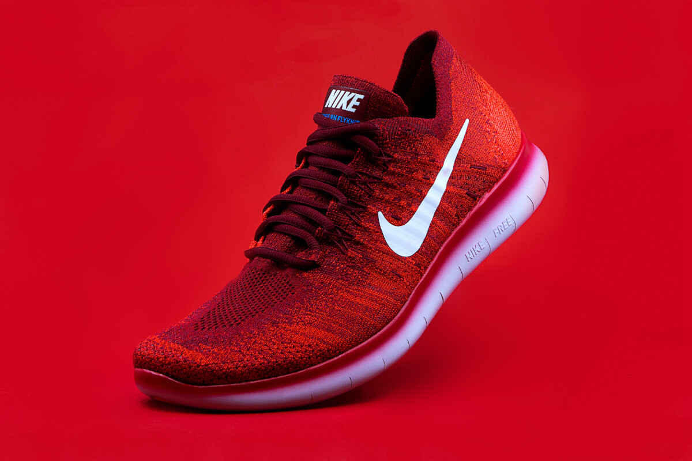

<!-- PROJECT LOGO -->
<br />
<p align="center">
  <a href="https://github.com/ChristianPredoianu/sneaker-store-v2-vue-composition-api-">
    
  </a>

  <h3 align="center">Netflix Clone Vue</h3>

  <p align="center">
   A Netflix clone to mimic Netflix functionality. Made with Vue.js 
    <br />
    <a href="https://github.com/ChristianPredoianu/netflix-clone-vue"><strong>Explore the docs »</strong></a>
    <br />
    <br />
    <a href="https://netclonevue.netlify.app/">View Demo</a>
    ·
    <a href="https://github.com/ChristianPredoianu/netflix-clone-vue/issues/issues">Report Bug</a>
    ·
   
  </p>
</p>


<!-- TABLE OF CONTENTS -->
<details open="open">
  <summary><h2 style="display: inline-block">Table of Contents</h2></summary>
  <ol>
    <li>
      <a href="#about-the-project">About The Project</a>
      <ul>
        <li><a href="#built-with">Built With</a></li>
      </ul>
    </li>
    <li>
      <a href="#getting-started">Getting Started</a>
      <ul>
        <li><a href="#prerequisites">Prerequisites</a></li>
        <li><a href="#installation">Installation</a></li>
      </ul>
    </li>
    <li><a href="#usage">Usage</a></li>
    <li><a href="#license">License</a></li>
    <li><a href="#contact">Contact</a></li>
    <li><a href="#acknowledgements">Acknowledgements</a></li>
  </ol>
</details>


<!-- ABOUT THE PROJECT -->
## About The Project

This project is made to mimic some of netflix functionality.

### Built With

* [Vue.js](https://vuejs.org/)
* [Firebase](https://firebase.google.com/)
* [Sass](https://sass-lang.com/)
* [Css](https://www.w3.org/Style/CSS/Overview.en.html)
* [HTML](https://developer.mozilla.org/sv-SE/docs/Web/HTML)


<!-- GETTING STARTED -->
## Getting Started

To get a local copy up and running follow these simple steps.

### Prerequisites

* npm
  ```sh
  npm install npm@latest -g
  ```

### Installation

1. Clone the repo
   ```sh
   git clone https://github.com/ChristianPredoianu/netflix-clone-vue.git
   ```
2. Install NPM packages
   ```sh
   npm install
   ```
   
3. Run dev server
   ```sh
   npm run serve
   ```


<!-- USAGE EXAMPLES -->
## Usage

To start using Netclone you have two options:

1.1 Sign in to Netclone with an existing account for demo purposes https://netclonevue.netlify.app/signIn:<br/>
    <b>Username</b>: test@test.com  
    <b>Password:</b> testingnetclone
    => choose an existing profile
   
1.2 Signup to Netclone with a <b>dummy email</b> made up by you. E.g (john@whatever.com) It doesn't need to be a valid email. And choose a <b>password.</b> 
    => Add a profile and continue with the selected profile.


<!-- LICENSE -->
## License

Distributed under the MIT License. See `LICENSE` for more information.


<!-- CONTACT -->
## Contact

Christian Predoianu - [@linkedin](https://se.linkedin.com/in/christian-predoianu-369218157) - christianpredoianu@yahoo.com

Project Link: [https://github.com/ChristianPredoianu/sneaker-store-v2-vue-composition-api-](https://github.com/ChristianPredoianu/sneaker-store-v2-vue-composition-api-)


<!-- ACKNOWLEDGEMENTS -->
## Acknowledgements


* [Font-Awesome](https://fontawesome.com/)


<!-- MARKDOWN LINKS & IMAGES -->
<!-- https://www.markdownguide.org/basic-syntax/#reference-style-links -->
[contributors-shield]: https://img.shields.io/github/contributors/github_username/repo.svg?style=for-the-badge
[contributors-url]: https://github.com/github_username/repo/graphs/contributors
[forks-shield]: https://img.shields.io/github/forks/github_username/repo.svg?style=for-the-badge
[forks-url]: https://github.com/github_username/repo/network/members
[stars-shield]: https://img.shields.io/github/stars/github_username/repo.svg?style=for-the-badge
[stars-url]: https://github.com/github_username/repo/stargazers
[issues-shield]: https://img.shields.io/github/issues/github_username/repo.svg?style=for-the-badge
[issues-url]: https://github.com/github_username/repo/issues
[license-shield]: https://img.shields.io/github/license/github_username/repo.svg?style=for-the-badge
[license-url]: https://github.com/github_username/repo/blob/master/LICENSE.txt
[linkedin-shield]: https://img.shields.io/badge/-LinkedIn-black.svg?style=for-the-badge&logo=linkedin&colorB=555
[linkedin-url]: https://linkedin.com/in/github_username 
